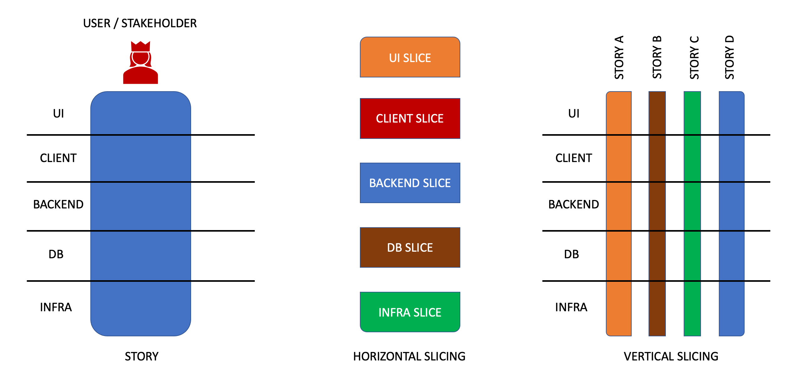

# Learning Hour: User Stories, Definition of Tickets, etc.

In this learning hour, you'll learn what user stories are, what is a good user story, how to define them
and how to slice them in the tickets, and what are the parts of a good user story.

## What is a user story

User story is a slice of work to be done that is both incremental and valuable. User story, by its
completion should add value to the overall product.

## INVEST formula

Good user stories should follow the INVEST formula:

- I — Independent (of all other user stories)
- N — Negotiable (not a specific contract for features)
- V — Valuable or Vertical (delivers end-to-end value increment to the overall product)
- E — Estimable (to a good enough approximation)
- S — Small (so as to fit within an iteration)
- T — Testable (can be tested and verified with a boolean outcome — either works or not)

## Vertical vs Horizontal slicing of work



Horizontal slicing is classic and isn't able to deliver incremental value (e.g., slicing by the tier
of architecture). Horizontal slicing increases risks of delivery.

Vertical slicing is a proper agile slicing of the work into user stories that allows for incremental &
valuable delivery. Vertical slicing reduces risks of delivery because of more frequent feedback, however,
requires more automated testing than horizontal.

## Components of a user story

Here are the usual components of the user story:

### WHY

The why behind the user story should explain why this user story is valuable and why we should play it.
Often used template for this is:

```
As a <customer type>
I need to be able to <do X>
So that I <get value Y>  
```

It's vital to make sure that "So that I" part actually talks about the user and business value that this
user story is delivering. This cannot be described in terms of the feature itself, and it has to be
described in terms of what problem it solves for the user or business.

Using the template above is good for when you're just starting out with user story writing, and later,
once you become proficient, you may not need the template anymore.

### Acceptance Criteria

Acceptance criteria is a set of conditions which have to be true for the user story to be considered as
done, and deployable to production. This can be a simple checklist of expected behaviors, however, it's
recommended to describe acceptance criteria as a set of acceptance test scenarios. BDD approach with 
Gherkin language is the most frequently used. For example:

```
Scenario: Soft-deleting the company
Given I am logged in as a Client
And I have a Company
When I delete the Company
Then I see that it was deleted
And I can see that Company in my Trash Bin

Scenario: Recovering a deleted company
Given I am logged in as a Client
And I have a soft-deleted Company
When I recover that Company
Then I see it in the list of active companies
And I don't see it anymore in my Trash Bin

Scenario: Deleting company permanently
Given I am logged in as a Client
And I have a soft-deleted Company
When I delete that Company permanently
Then I don't see it in the list of active companies
And I don't see it anymore in my Trash Bin
```

### Extra supporting information

This is all optional and depends on a particular user story:

- Screenshots
- References to the design (e.g., Figma, Zeplin, etc.)
- Technical notes generated from an engineering discussion
- Proposed solutions
- etc.

## Kata

Take any of your user stories that weren't well-defined and try to define it as an ensemble.
